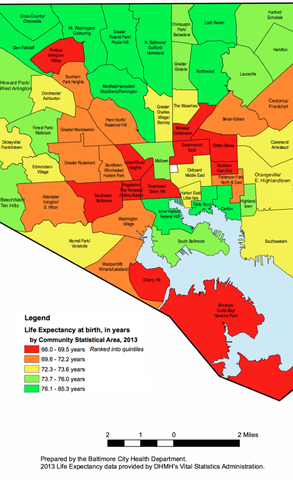

---
output:
  html_document:
    keep_md: true
---

This post was inspired by a project that I worked on for our department's [Advanced Data Science](http://jtleek.com/advdatasci16/) course, and will get you familiar with using an API to scrape data from the web, reading in shapefiles into R, and converting this geographic information into a data frame that can be visualized with ggplot2. The ultimate goal is to use R to produce a visualization similar to the one below.



Before we get started, here is the code to download all of the packages we'll be using, since it is unlikely you will have many of these unless you are familiar with using an API and visualizing geographic data in R.

```{r, results="hide", , message=FALSE, eval=FALSE}
install.packages('jsonlite')
install.packages('rgdal')
install.packages('ggplot2')
install.packages('ggmap', type = 'source')
install.packages('downloader')
install.packages('dplyr')
install.packages('sp')
install.packages('maptools')
install.packages('plyr')
install.packages('curl')
```

We will be visualizing life expectancy in the 55 Community Statistical Areas (CSAs) within Baltimore, so we want to grab the geographic coordinates for the borders of these CSAs. Luckily, R can import this type of information, which is usually contained in shapefiles (there is a [Wikipedia page](https://en.wikipedia.org/wiki/Shapefile) about shapefiles if you're interested in learning more about the format). To find the shapefiles, I simply googled "shapefiles baltimore csa" and ended up [here](http://bniajfi.org/mapping-resources/). We want the most recent Community Statistical Areas (CSAs) shapefiles, which as of now is 2010. 

One way of downloading the shapefiles is to simply click the link, unzip the compressed shapefiles, and then move the relevent files into your working directory. However, if you want your work to be fully reproducible, I think it's useful to get used to downloading files from the web with R. This can be done with the following code block. I found the readOGR function by googling how to read shape files into R.
```{r, , message=FALSE, results="hide"}
library(downloader)
url <- 'http://bniajfi.org/wp-content/uploads/2014/04/csa_2010_boundaries.zip'
download(url, dest='shapes.zip', mode="wb")
unzip('shapes.zip', exdir=getwd())
```

Thanks to this helpful [r-bloggers post](https://www.r-bloggers.com/things-i-forget-reading-a-shapefile-in-r-with-readogr/), I discovered how to use the readOGR function from the rgdal package in order to read shapefiles into a SpatialPolygonsDataFrame.

```{r, results="hide", message=FALSE}
library(rgdal)
library(sp)
csa <- readOGR(getwd(), "CSA_NSA_Tracts")
```

A SpatialPolygonsDataFrame has "slots" that can be accessed with the @ symbol (not the \$ symbol like in a normal data frame). Let's first check out the data slot.

```{r, results="hide"}
dim(csa@data)
head(csa@data)
```

First, we are only interested in the CSAs (called Community in this data), so let's only keep that variable.

```{r, message=FALSE, results="hide"}
library(dplyr)
csa@data <- csa@data %>% select(Community)
```
Second, it looks like there is one row for each CSA. However, note that there are 56 rows, although I mentioned there were only 55 CSAs in Baltimore. Let's investigate this further.

```{r, results="hide"}
csa@data$Community
```

If you look carefully, the 51st row is actually the Baltimore jail, so we'll just remove this from our data. 
```{r, results="hide"}
csa <- csa[-51,]
csa@data <- droplevels(csa@data)
```

Now let's look into the what makes this a SpatialPolygonsDataFrame--the polygons. I'm going to use the 4th element, because it's relatively small.

```{r, results="hide"}
csa[4,]@polygons
```

What's up with those coordinates? It turns out that you have to do something to turn them into latitude and longitude. [This StackExchange post](http://gis.stackexchange.com/questions/142156/r-how-to-get-latitudes-and-longitudes-from-a-rasterlayer) was very helpful with this step.

```{r, message=FALSE, results="hide"}
llprj <-  "+proj=longlat +ellps=WGS84 +datum=WGS84 +no_defs +towgs84=0,0,0"
csa <- spTransform(csa,  llprj)
csa[4,]@polygons
```

Now let's get life expectancy data. [OpenBaltimore](https://data.baltimorecity.gov) has lots of publicily available data. The data for life expectancy is [here](https://data.baltimorecity.gov/Neighborhoods/Children-and-Family-Health-Well-Being-2010-2014-/rtbq-mnni). 

But how are we going to download this to R? Like before, one option is to click export, download as a CSV, then read the data into R. But there is another option, which is to use an API. APIs are a way for programs like R to grab data from the internet without having a human do any pointing and clicking (at least this is my understanding of APIs--read more about APIs at the [Wikipedia page](https://en.wikipedia.org/wiki/Application_programming_interface)). Note when you click export, there is a tab named 'SODA API'. Clicking on this tab, we then get the link to use for the API under the header 'API Endpoint'. We will then use the R package jsonlite to download the data direcly into R.

```{r, message=FALSE, results="hide"}
library(jsonlite)
well_being <- fromJSON("https://data.baltimorecity.gov/resource/ivtw-hiv6.json")
```

Whenever I download or read anything into R, I usually run the following three commands to get a sense of what I'm going to be working with and to make sure nothing has gone wrong.

```{r, results="hide"}
class(well_being)
dim(well_being)
head(well_being)
```

It looks like there are lots of variables, for lots of different years. The two important ones for us are the csa name (csa2010) and life expectancy (let's use 2014, since it's the most recent--lifeexp14).

```{r, results="hide"}
well_being <- select(well_being, csa2010, lifeexp14)
```

Cool! We're almost there. Now let's assign the life expectancies we downloaded earlier to the CSAs.

```{r, results="hide"}
key <- na.omit(match(csa@data$Community, well_being$csa))
csa@data$life_expectancy <- as.numeric(well_being$lifeexp14[key])
```

Finally, let's map this stuff! We're going to use ggmap and ggplot2. First, let's get a map of Baltimore up using ggmap. This will get us a Google Maps quality map within R. You can play around with the zoom level yourself to see the changes.

```{r, message=FALSE}
library(ggmap)
myggmap <- get_map(location="Baltimore", zoom=12)
ggmap(myggmap) + xlab("Longitude") + ylab("Latitude")
```

Cool! Now we want to overlay the CSA boundaries. I'm going to use some code to get the SpatialPolgyonsDataFrame Polygons to a data frame that can be used in plotting that I found in the [tidyverse GitHub repo](https://github.com/tidyverse/ggplot2/wiki/plotting-polygon-shapefiles)

```{r, message=FALSE}
library(maptools)
library(plyr)
csa@data$id <- csa@data$Community
csa.points <- fortify(csa, region="id")
csa.df <- join(csa.points, csa@data, by="id")
```

Now we can use the geom_path function from ggplot2 to plot the boundaries of the CSAs.

```{r, message=FALSE}
library(ggplot2)
ggmap(myggmap)+ 
  xlab("Longitude") + ylab("Latitude")+
  geom_path(data=csa.df, aes(x=long, y=lat, group=group), color="black")
```

Finally, we use the geom_polygon function from ggplot2 to fill each CSA by life expectancy. The scale_fill_gradientn function changes the color scheme to match that of the original image we're trying to reproduce. You can play around with the alpha argument in geom_polygon to change how transparent the coloring is.

```{r}
ggmap(myggmap)+ 
  xlab("Longitude") + ylab("Latitude")+
  geom_path(data=csa.df, aes(x=long, y=lat, group=group), color="black")+
  geom_polygon(data=csa.df, aes(x=long, y=lat, group=group, fill=life_expectancy), alpha=.75) +
  scale_fill_gradientn("Life expectancy", colors=c('red', 'yellow', 'green'))
```

And there you go! As always, feel free to use the links at the bottom of my page to get in contact with me if you have any questions.  